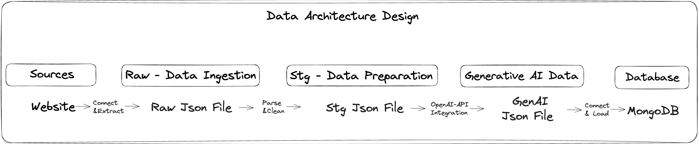
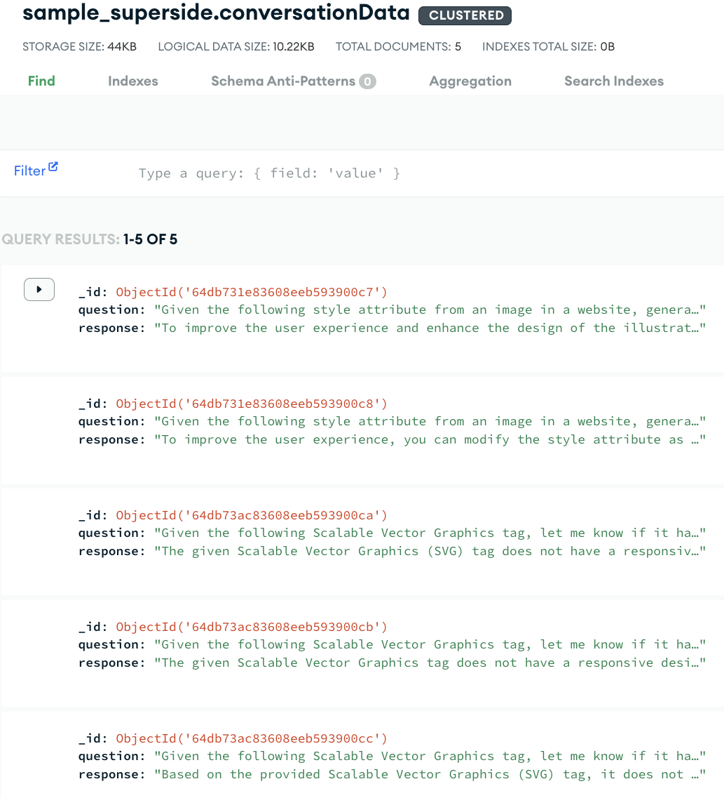
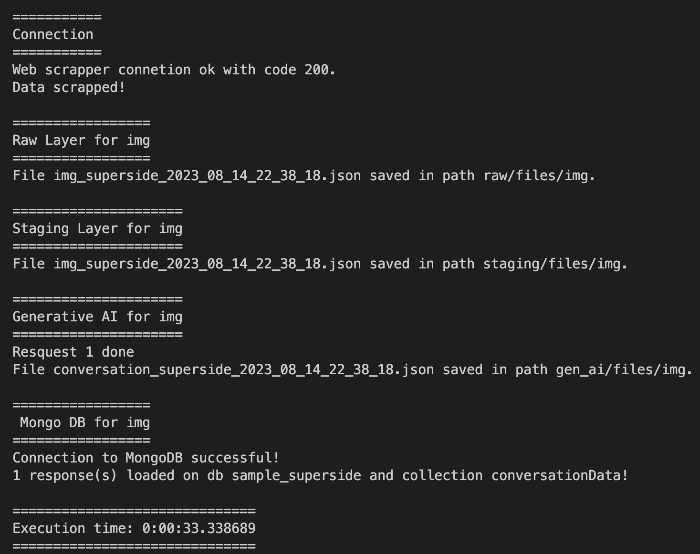

# Table of Contents
- [Introduction](#introduction)
- [Why This Project?](#why-this-project?)
- [Data Architecture](#data-architecture)
- [Running the Project](#running-the-project)
- [Project Structure](#project-structure)
- [Design Decisions](#design-decisions)
- [Improvements and Considerations](#improvements-and-considerations)
<br><br>

# Introduction <a name="introduction"></a>
---
This documentation is intended to show the program' deliverable, [Challenge](docs/Data%20Engineer%20GenAI-Assesment.pdf), that's a end-to-end process starting from a web-scrapping and using the data gathered as an input for a Generative-AI module to enhance customers' understand traits and identify what is resonating best with them, as well the data architecture, 'How to run' guidance, code structure, some decisions made and final thoughts.<br>

The data gathered is loaded in separate layers - raw, staging, and generative-ai - where in the raw layer, there are the files that came from web-scrapping with no treatment, staging layer, there are files with generative-ai prepared data, and generative-ai layer has the response from the open-ai API.
<br><br>

# Why This Project? <a name="why-this-project?"></a>
---
This project was born with the need to improve the superside' website user experience, in order to cause a fantastic firts impression and as a consequence get more customers.

In a nutshell, this program gets all the Images(img tags in the html code) and Scalable Vector Graphics(svg tags in the html code), that's a format to create two-dimensional graphics and animations, with its respective style attribute, that's like a paint palette, a way for to tell the web browser how we want things to look on the webpage, and make question to a generative AI platform to help us responding how can we improve the image style and how to make the SVG - two-dimensional graphics and animations - responsive to ensure that your styles will adapt well to different screen sizes and devices. 

Imagine the user see the a good web page from a computer, but when he/she access from mobile device the experience get worst? Yeah, That's a bad for the final user!

So, we get each style attribute from the website, use it as input for the Chat GPT, and save theses informations in a database to start the creative proccess of analysing and getting insights from them.
<br><br>

# Data Architecture <a name="data-architecture"></a>
---


## Overview
This section outlines the architecture design for a web scraping automation data pipeline going through each step, from the data integration and processing, going through OpenAI API connection, until persisting the final data in a NoSQL database. In a nutshell, this ETL process has the following steps:

1 - Connection with the website.<br>
2 - Scrape the data from the website.<br>
3 - Save the data as JSON file in a RAW layer.<br>
4 - Transform the data.<br>
5 - Save parsed data as a JSON file in a STAGING layer.<br>
6 - Integrate with GPT-3 API using STAGING Layer' data as input.<br>
7 - Load the API response as JSON in a GENERATIVE DATA Layer.<br>
8 - Loading final data in MongoDB.<br><br>

### 1 - Connection with the website to scrape the data
---
* Establish a connection with the target website to fetch data using Python's requests library.
    ```python
    #main.py
    response = connector.conn_scrap(url)    

    #connectors module
    import requests
    class Connectors:
        def conn_scrap(self, url):
            try:
                response = requests.get(url, timeout=5)
                response.raise_for_status()
            except requests.exceptions.HTTPError as errh:
                print(errh.args[0])
            return response
    ```

### 2 - Scrape the data from the website
---
*  Scrape data as a dict of list with all ocurrence of both tags
    ```python
    #main.py
    data = web_scraper.scrap_website(response)

    #web_tag_scraper module
    def scrap_website(self, response):
        if response.status_code == 200:
            soup = BeautifulSoup(response.content, "html.parser")
            data = {"img": self.get_tag(soup,"img"), "svg": self.get_tag(soup,"svg")}
            return data
        else:
            print("Failed to fetch data. Status Code:", response.status_code)

    def get_tag(self, soup, tag):
        tags = [str(i) for i in soup.find_all(tag)]
        return tags            
    ```
    Example of the dict grabbed:
    ```json
    {"img": [""
            ,""]
    ,"svg": ["<svg tag1 </svg>",
             "<svg tag2 </svg>" ]
    }
    ```

### 3 - Save the data as JSON file in a RAW layer
---
* Store the raw data as JSON in the RAW layer(file directory) for archival purposes.
    ```python
    #main.py  
    data = scrap_website(response) #scrap_website function is described in above step
    for tag in data.keys(): #where each key is the selected tag
        raw_data = {domain: data[tag]} #where domain is the website domain
        file_saver.save_to_json(
            raw_data,
            config["path"]["dir"].format(step="raw",folder=tag),
            config["file_name"][tag].format(domain=domain,curr_dt=curr_dt)
        )
    
    #file_saver module
    def save_to_json(self, data, path, filename):
        os.makedirs(path, exist_ok=True)
        with open(path+"/"+filename, "w", encoding="utf-8") as jsonfile:
            json.dump(data, jsonfile, ensure_ascii=False, indent=4)
    ```
    raw_data:
    ```json
        {
        "superside": [
             ""
            ,"",
            ]
        }
    ```

### 4 - Transform the Data
---
* Transform through getting the tag' style attribute preparing it for integration with GPT-3.
    ```python
    #main.py
    style_attr_data = web_scraper.get_style_attr(raw_data[domain],tag)
    staging_data = {domain: style_attr_data}

    #web_tag_scraper module
    def get_style_attr(self, data, tag):
        dict_style_attr = {}
        for i in data:
            soup = BeautifulSoup(i, 'html.parser')
            _tag = soup.find(tag)
            dict_style_attr.__setitem__(str(_tag),_tag.get("style"))
    ```
    get_style_attr' return:
    ```json
    {
        "img": {
             "":"style=style1"
            ,"":"style=style2"
        }
    }
    ```

### 5: Save Parsed Data to STAGING Layer
---
* Save the cleaned data as a JSON file in the STAGING data layer.
    ```python
    staging_data = {domain: style_attr_data}
    file_saver.save_to_json( ##save_to_json function is described in step 3
        staging_data,
        config["path"]["dir"].format(step="staging",folder=tag),        
        config["file_name"][tag].format(domain=domain,curr_dt=curr_dt)
    )
    ```
    get_style_attr' return:
    ```json
    {
        "img": {
             "":"style=style1"
            ,"":"style=style2"
        }
    }
    ```    

### 6 - Integrate with GPT-3 API using STAGING Layer' data as input
---
* Integrate with the GPT-3 API using the openai library to generative-AI module.
    ```python
    #main.py
    gen_dict = {}
    gen_input = staging_data[domain]

    for tag,style_attr in gen_input.items():

        if tag == "img":
            prompt = config['prompt']['img_style_prompt'].format(html_parameter=style_attr)
        else:
            prompt = config['prompt']['svg_resp_prompt'].format(html_parameter=tag)

        generated_response = gen_ai.get_generated_response(prompt)
        gen_dict.__setitem__(prompt, generated_response)    
    
    #gen_ai_forge module
    import openai
    def get_generated_response(self, prompt):
        openai.api_key = self.api_key
        response = openai.ChatCompletion.create(
            model="gpt-3.5-turbo", messages=[{"role": "user", "content": prompt}]
        )
        return response["choices"][0]["message"]["content"]
    ```
    get_generated_response' return is a simple string wiht the prompt' asnwer.
    gen_dict:
    ```json
    {
        "question": "response" 
    }
    ```

### 7 - Load the API response as JSON in a GENERATIVE DATA Layer<br>
---
* Store the GPT-3 API response as JSON in the GENERATIVE DATA layer.
    ```python
    #main.py
    conversation_dict = { "conversation":[ {"question":k, "response":v} for k,v in gen_dict.items() ] }
    generated_data  = {domain: conversation_dict}

    file_saver.save_to_json(
        generated_data,
        config["path"]["dir"].format(step="gen_ai",folder=key),
        config["file_name"]["gen_ai"].format(domain=domain,curr_dt=curr_dt)
        )
    ```
    generated_data:
    ```json
    {
    "superside": {
        "conversation": [
                {
                "question": "That's the question.",
                "response": "That's the response."
                }
            ]
        }
    }
    ```

### 8 - Loading final data in MongoDB
--- 
* Load the generative data into a MongoDB database.
    ```python
    #main.py
    mongodb = MongoDB(conn=conn, dbname=dbname, collec=collec)
    mongodb.load_data(data)

    #mongodb_ops module
    def connect(self):
        client = MongoClient(self.conn, tlsCAFile=certifi.where())
    
    def load_data(self, data):
        try:
            collection = self.connect()[self.dbname][self.collec]
            collection.insert_one(data)
        except Exception as e:
            print(e)
    ```    
    MondoDB sample data:
    
<br><br>


# Running the Project <a name="running-the-project"></a>
---
In order to run this project it's necessary to follow the 4 steps bellow:

1 - Clone the repository
    ```
    git clone
    ```

2 - Install dependencies
    ```
    pip3 install -r requirements.txt
    ```

3 - Create a virtual environment(optional)
 - Create venv: 
    ```
    python3 -m venv {name_venv}
    ```
 - Activate venv: 
    ```
    source {name_venv}/bin/activate
    ```
 - Deactivate vm:
    ```
    deactivate
    ```

4 - Run the application
    ```
    python3 main.py
    ```
<br />

Picture showing a example of a end-to-end pipeline for 1 tag of 1 response:
    
<br><br>


# Project Structure <a name="project-structure"></a>
---
```bash
superside_case/
├── src/
│   ├── main.py
│   ├── tests.py
│   ├── pyutils/
│   │   ├── __init__.py
│   │   └── connectors.py
│   │   └── file_saver.py
│   │   └── gen_ai_forge.py
│   │   └── mongodb_ops.py
│   │   └── remove_files.py
│   │   └── web_tag_scraper.py
├── docs/
│   ├── pictures
├── data/
│   ├── raw
│   │   |── files
│   │   |   └── img
│   │   |   └── svg
│   ├── staging
│   │   |── files
│   │   |   └── img
│   │   |   └── svg
│   ├── gen_ai
│   │   |── files
│   │   |   └── img
│   │   |   └── svg
├── config/
│   ├── config.ini
└── README.md
└── requirements.txt
└── .gitignore
```

# Design Decisions <a name="design-decisions"></a>
---
- Data Architecture<br>
    - Which data would you store? Why and how would you store it?<br>
        - Json in the MongoDB.<br>
            - As Json files are hierarchical structure, it's easy to represent the nature of HTML which has parent-child relationships.<br>
            - It's commonnly used by APIs and databases for data exchange, so it will be good when we start to connect to APIs.<br>
            - Support various data types, that accomodate the vast types of data from an HTML.<br>
            - And as the data will be stored in MongoDB, that's a documented-oriented data model, be a JSON is a optimal choice due to the natural fit for this model. You can store varying data structures within the same collection and JSON support for nesting objects which aligns with MongoDB's ability to store nested documents and arrays.


- Scraping<br>
    - Justify your choice of each library or framework used.
        - beautiful soup<br>
            Popular, parsing HTML and XML documents, Ease of use, powerful features, and its ability to handle messy and poorly formatted HTML, and integration with requests library.
        - requests<br>
            Simplicity, most used, HTTP Methods and Headers (so for the future API Jobs). URL Parameters and Query Strings as features essential for specific queries/searchs.<br>

- Generative AI <br>
    - Explain your solution:<br>
        - It's a module that has the responsibility of generate data with AI method, through asking a question for the OpenAI API (GPT-3 in that case), getting the answer and saving these informations to make this relationships between the question and answer.<br>

    - Justify your choice of each library or framework used.<br>
        - openai<br>
            The official , openai, provides a simple and convenient way,through abstracts the HTTP requests and authentication, to interface with OpenAI's API, including the GPT-3 model. 
<br><br>


# Improvements and Considerations <a name="improvements-and-considerations"></a>
---
Check about the rate and maximum tokens<br>
Prompt evaluation<br>
Create the description for each function
...
